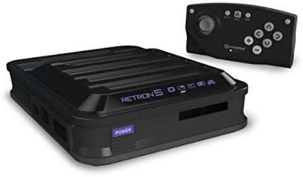

# [Softmodding the Wii like its 2018](https://scala.sh/wii/)

## Downloads

Cutting straight to the chase:

[https://scala.sh/wii/downloads](Downloads)

The entire working "apps" dir may be downloaded with the following command:

    wget -r --no-parent -k https://scala.sh/wii/downloads/apps

## Pre-requisites

* Installed the Homebrew channel
* Installed d2x IOS to slots 249 and 250

## I thought it'd be easy in 2018!

How did I get to spending so much time trying to revive and soft-mod a Wii 12 years after it originally came out?

### Nintendo Switch triggered my craving and the urge :)

So we obtained a Nintendo Switch over the holidays, and it's pretty snazzy.  I'm also finding myself reflecting on all the awesome titles from the early days of Nintendo, SNES, and GameCube.  After playing Switch games like Mario world, Mario Kart, and Zelda, I've been left yearning for the originals.  Well, no worries, there are some in the online store.  I purchased the available retro throwback titles from my youth like the original `Mario Bros`, and `King Of Fighters KoF '96` (disclosure: never saw KoF before, but it's super similar to Street Fighter II and Mortal Kombat).  Well, this actually hasn't quenched my thirst, in fact it's made it worse.  Now all I can think about is how awesome `Final Fight` ([1](http://streetfighter.wikia.com/wiki/Final_Fight), [2](https://en.wikipedia.org/wiki/Final_Fight_(video_game)) was, what a badass game!

[Are there any plans to release Final Fight for the Switch?](https://www.gamefaqs.com/boards/189706-nintendo-switch/75267542)

Spoiler Alert: NO!  Not as far as I could tell.

I stewed over this for a few days, and thought maybe I could [snag an SNES off ebay..](http://archive.is/GHgUy), and whoa, that's actually pretty expensive.  Then I wondered about [SNES on Amazon](http://archive.is/Zar2G), not much better.  Then I scrolled down the page and noticed something called a "Retro-Bit", which accepts game cartridges for both NES and SNES games.

"Wow", I thoght, "This is it!"

I continued to dig for a bit, and discovered many variants.

* Retro-Bit Duo: NES + SNES
* Retro-Bit Super RetroTRIO: NES + SNES + Genesis
* Hyperkin RetroN 3: NES + SNES + Genesis
* Hyperkin RetroN 5 HD: NES / SNES / Gameboy / Gameboy Advanced / Gameboy Color / Sega Genesis / Super Famicom / Mega Drive

The dialog in my head went like this:

"The idea is cool, right?  No, it's amazing and magical!  I'll be able to play almost anything!!!"

Just look at the Hyperkin RetroN 5 HD:

"Hrm, well actually I've never even heard of a Super Famicom or Mega Drive.  What are they?"

Reality check: The only game cartridges I have are for the [Intellivision](https://en.wikipedia.org/wiki/Intellivision) my sister gave me for christmas 2 years ago.  It's awesome, for sure, but otherwise not relevant to this quest to relive the magic of Final Fight.

I realized:

"I'm not going to need all that."

Also, the reviews for pretty much all of those Retro-Hypermushkin Bit multi-cartridge systems indicated that quality was spotty.  Furthermore, acquiring the physical game cartridges seems expensive, would require even more patience.

*Throwback*

Remember how flaky the original NES and SNES were?

1. Insert game to system.
2. Doesn't start, or has weird green / multi-colored corruption artifacts.
3. Remove, hold up to mouse and blow back and forth into it like a harmonica.
4. Reinsert cartridge into system.
5. If the game starts, it's your lucky day!  Also, You've probably already done this 3 times.
4. If not, go back to step 1.

 (or attempting to get some any of the 
These days there are also these [5000 games in 1](http://archive.is/bbEmP) things, but most of the games I'd never even heard of.

Bottom line, this path seemed tedious, temperamental, and error-prone.

"How do 30 year old game cartridges hold up over time?" I wondered.

Then it hit me.

"Can the Wii play old Nintendo games?"

[google.com/search?q=wii+play+old+Nintendo+games](http://archive.is/GjfqU)

YES!

That sounded promising!  Especially because I've got one vanilla Wii and another with a mod-chip which was super good (in 2007/8, anyways).

I was elated :)

I installed a sweet mod chip to Wii #1 back in 2008, then I never booted it since 2010.

When I tried booting it this week (in early January of 2018), it displays a momentary black screen, then no further video output is detected on the television.

Bummer.

The other one works great though.

But without a mod-chip, a software modding approach is required.

### Easier said than done

I thought that by now, 12 years after launch, modding the Wii would be a cake walk.  And I bet if you follow some other more perfect path through the process than I did, it could be easier.

If I were to start over, I would have just purchased an SD card reader and used a PC to go the [ModMii](https://github.com/davebaol/d2x-cios/wiki/How-to-install-d2x-cIOSs-on-your-Wii#modmii) route.

I don't have an SD card reader for a PC, and the only SD card reader I have access to is in the form of a Mac laptop.

## Soft-modding the Wii

1. Install the Homebrew channel.

2. Install the d2x IOS.

Pretty good instructions:

[https://sites.google.com/site/completesg/backup-launchers/installation](https://sites.google.com/site/completesg/backup-launchers/installation)

See:

* [http://gwht.wikidot.com/d2x](http://gwht.wikidot.com/d2x)
* [https://github.com/davebaol/d2x-cios/wiki/How-to-install-d2x-cIOSs-on-your-Wii#d2x-cios-installer](https://github.com/davebaol/d2x-cios/wiki/How-to-install-d2x-cIOSs-on-your-Wii#d2x-cios-installer)

3. Use USB Loader

* [http://gwht.wikidot.com/usb-loader](http://gwht.wikidot.com/usb-loader)

## Solutions to errors encountered along the way

### Installing USB Loader

#### Context

Installed custom IOS v10 beta53-alt into slot 249 and v10 beta52 into slot 250.

#### Error Message

Launched USB Loader and was greeted with:

    Error: Custom IOS 222 is a stub!

#### Explanation

This is caused by installing Wii system updates which insert dummy non-functional IOS stubs into slots 222, 223 and others.

happens when the Wii gets updated a

#### Solution

Follow [the instructions](http://gwht.wikidot.com/hermes-ios222-223) to reinstall a proper working IOS version in slots 222 and 223.

After performing that procedure, you'll also need to reinstall d2x to slots 249 and 250.

#### Solution

## Errors and issues as yet unsolved

* Wii boots to a black screen and then nothing happens

